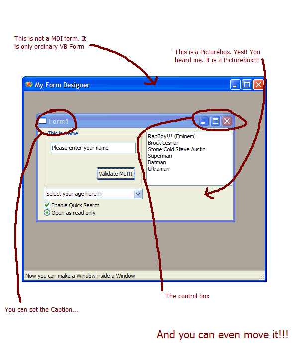



## Windows IN Windows \(like VB\)

### Description

Hi, all dudes out there. This thing is very cool. Have you ever imagine that you could make a window within a window without using MDI form? Well, this is the solution. Using only couple of API, you can create window inside window like vb does...
 
### More Info
 

             |
---                |---
**Submitted On**   |2003-04-19 10:26:02
**By**             |[Shukri Zahari](https://github.com/Planet-Source-Code/PSCIndex/blob/master/ByAuthor/shukri-zahari.md)
**Level**          |Advanced
**User Rating**    |3.8 (15 globes from 4 users)
**Compatibility**  |VB 4\.0 \(16\-bit\), VB 4\.0 \(32\-bit\), VB 5\.0, VB 6\.0
**Category**       |[Windows API Call/ Explanation](https://github.com/Planet-Source-Code/PSCIndex/blob/master/ByCategory/windows-api-call-explanation__1-39.md)
**World**          |[Visual Basic](https://github.com/Planet-Source-Code/PSCIndex/blob/master/ByWorld/visual-basic.md)
**Archive File**   |[Windows\_IN1576304192003\.zip](https://github.com/Planet-Source-Code/shukri-zahari-windows-in-windows-like-vb__1-44861/archive/master.zip)

